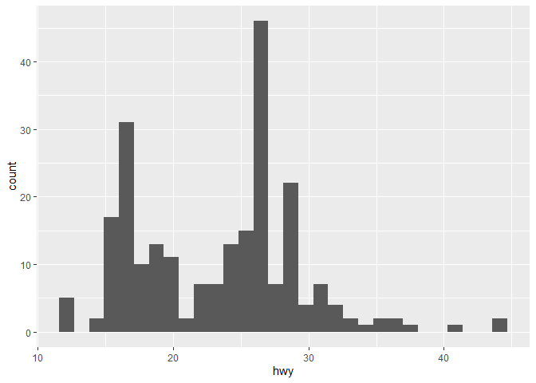
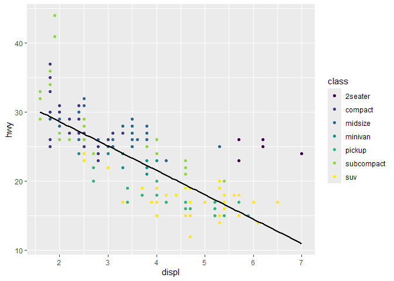

# Visualize Data
Karla Buitrago-Yepes

## Your Turn 0

Add a setup chunk that loads the tidyverse packages.

``` r
#|label: Read in Data
mpg #built in data set
```

    # A tibble: 234 × 11
       manufacturer model      displ  year   cyl trans drv     cty   hwy fl    class
       <chr>        <chr>      <dbl> <int> <int> <chr> <chr> <int> <int> <chr> <chr>
     1 audi         a4           1.8  1999     4 auto… f        18    29 p     comp…
     2 audi         a4           1.8  1999     4 manu… f        21    29 p     comp…
     3 audi         a4           2    2008     4 manu… f        20    31 p     comp…
     4 audi         a4           2    2008     4 auto… f        21    30 p     comp…
     5 audi         a4           2.8  1999     6 auto… f        16    26 p     comp…
     6 audi         a4           2.8  1999     6 manu… f        18    26 p     comp…
     7 audi         a4           3.1  2008     6 auto… f        18    27 p     comp…
     8 audi         a4 quattro   1.8  1999     4 manu… 4        18    26 p     comp…
     9 audi         a4 quattro   1.8  1999     4 auto… 4        16    25 p     comp…
    10 audi         a4 quattro   2    2008     4 manu… 4        20    28 p     comp…
    # ℹ 224 more rows

## Your Turn 1

Run the code on the slide to make a graph. Pay strict attention to
spelling, capitalization, and parentheses!

``` r
#|label: plot1
#initialize with data then add mapping/aesthetics 
ggplot(data = mpg)+
  geom_point(aes (x= displ, y = hwy))
```


## Your Turn 2

Replace this scatterplot with one that draws boxplots. Use the
cheatsheet. Try your best guess.

``` r
ggplot(data = mpg) +
  geom_boxplot(mapping = aes(x = class, y = hwy))
```


## Your Turn 3

Make a histogram of the `hwy` variable from `mpg`. Hint: do not supply a
y variable.

``` r
#|label: Histogram
ggplot(mpg) +
  geom_histogram(aes(x = hwy))
```

    `stat_bin()` using `bins = 30`. Pick better value with `binwidth`.



## Your Turn 4

Use the help page for `geom_histogram` to make the bins 2 units wide.

``` r
#|llabel: Modifying aesthetics
ggplot(mpg) +
  geom_histogram(aes(x = hwy),binwidth= 2)
```


## Your Turn 5

Add `color`, `size`, `alpha`, and `shape` aesthetics to your graph.
Experiment.

``` r
#|label: Good Visual, Scatterplot
ggplot(data = mpg) +
  geom_point(mapping = aes(x = displ, y = hwy,color= class), alpha= 0.5 )+
  labs(title= "The Bigger the engine the less mileage gotten on the highway", color= "Class of Vehicle", y = "Highway Mileage", x= "Size of Engine")+
  theme_light()
```


## Help Me

What do `facet_grid()` and `facet_wrap()` do? (run the code, interpret,
convince your group)

``` r
#|label: Faceting
# Makes a plot that the commands below will modify
q <- ggplot(mpg) + geom_point(aes(x = displ, y = hwy))

q + facet_grid(. ~ cyl)#multiple columns 
```


``` r
q + facet_grid(drv ~ .)#multiple rows 
```


``` r
q + facet_grid(drv ~ cyl)# mult columns and rows 
```


``` r
q + facet_wrap(~ class)#mult columns and rows 
```


## Your Turn 6

Make a bar chart `class` colored by `class`. Use the help page for
`geom_bar` to choose a “color” aesthetic for class.

``` r
#|label: Bar plot
ggplot(mpg) +
  geom_bar(aes(x = class, fill = class))+
  guides(fill= "none")+ #rid of legend
  labs(x= "Class of Vehicle", 
       y= "Number of Vehicles in Sample")+
  theme_bw()
```


## Quiz

What will this code do?

> Two graphs on one plot overlaying the smooth trend line over a
> scatterplot. The graph is saved in out project/ directory with ggsave.

``` r
#|label: overlayed scatter plot
ggplot(mpg, aes(displ, hwy)) + #make universal aesthetics so will not have to go through and put in each geom
  geom_point(aes(color = class)) +
  geom_smooth(color= "black",
              se=FALSE,
              method = "lm")+ 
  scale_colour_viridis_d()
```

    `geom_smooth()` using formula = 'y ~ x'



``` r
  ggsave("example.jpg", width = 6, height = 4)
```

    `geom_smooth()` using formula = 'y ~ x'

------------------------------------------------------------------------

# Take aways

You can use this code template to make thousands of graphs with
**ggplot2**.

``` r
ggplot(data = <DATA>) +
  <GEOM_FUNCTION>(mapping = aes(<MAPPINGS>))
```
